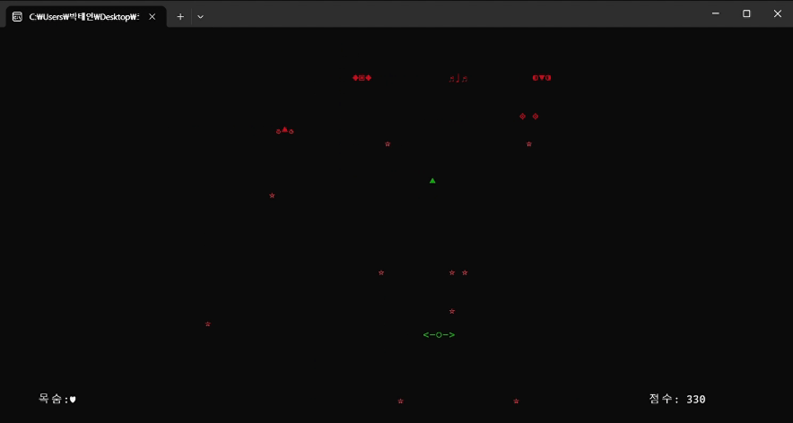

# 🚀 Shooting Game (C Language)

A console-based spaceship shooting game developed in C.  
This project includes a start screen, player and enemy movement, bullet firing, collision detection, score tracking, and more.

---

##  Project Overview

- **Language**: C
- **Platform**: Windows Console
- **Goal**: Build a classic shooting game using only C and Windows API
- **Key Features**:
  - Start screen with ASCII art
  - Player and enemy movement
  - Bullet firing and collision detection
  - Score tracking and game over screen

---

## Technical Research

- Studied `windows.h`, `stdbool.h`
- Implemented `gotoxy()` for cursor movement
- Replaced `kbhit()` with `GetAsyncKeyState()` for real-time input
- Solved issues with character ghosting and infinite spawning
- Optimized memory usage

---

##  Game Features

### 🖼️ Start Screen
- ASCII art intro
- Menu options: Start Game, Help, Exit

### 🎮 Gameplay
- Player movement with arrow keys
- Bullet firing with `Space`
- Enemies spawn randomly and move across the screen
- Collision detection between bullets and enemies
- Score increases by 10 per enemy hit

### 💥 Game Over
- Player has 3 lives (hearts)
- Game ends when all lives are lost
- Final score is displayed with "THE END" message

---

## Implementation Details

### 📁 Header Files
- `player_functions.h`: text color, cursor hiding, gotoxy
- `game_functions.h`: menu, help screen, player draw/erase

### 📂 Source Files
- `player_functions.c`: Implements cursor and color functions using Windows API
- `game_functions.c`: Implements UI and player rendering
- `Shooting_game.c`: Main game loop, input handling, enemy logic, collision detection

### ⌨️ Input Handling
```c
if (GetAsyncKeyState(VK_LEFT) & 0x8000) {
    *ch = LEFT;
}
```

### ⌨️ Real-time Key Detection using `GetAsyncKeyState()`

- Allows smooth and continuous movement  
- Supports multiple simultaneous key presses  
- Ideal for interactive applications like games  

---

## Development Log

| Date       | Progress |
|------------|----------|
| 2023-10-08 | Start screen completed |
| 2023-10-31 | ASCII art updated, help screen added, input bug fixed |
| 2023-11-02 | Bullet firing (space), speed control (Q/E) added |
| 2023-11-15 | Enemy random spawn, ghosting issue fixed |
| 2023-11-20 | Enemy bullet logic, life system added |
| 2023-11-25 | Score system implemented, collision bug fixed |
| 2023-12-03 | Enemy spawn position adjusted, bullet visuals improved |
| 2023-12-10 | Start screen redesigned, final testing completed |
| 2023-12-13 | Replaced ASCII letters with "●", added border |

---

## 📸 Screenshots

## 🎮 Screenshots & Gameplay

### 🧵 Start Screen Update

**Before**


 ⬇️

**After**


---

### ❓ Help Page  
> Shows control instructions and pauses the console until a key is pressed.


---

### ❤️ Life System (Player Health)

 ➡️

 ➡️


---

### 🕹️ Gameplay Preview


---

### 💀 Game Over Screen



---

## 🔧 Planned Features

- Item drops (extra life, weapon upgrades)  
- Level-based difficulty scaling  
- Sound effects and background music  
- Save system and high score leaderboard  

---

## 🧠 Challenges & Learnings

- Implementing real-time input without `kbhit()` was tricky  
- ASCII art design took significant effort  
- Learned modular programming with header/source files  
- Gained deeper understanding of Windows console programming  

---

## 📌 References

- 윤성우의 열혈 C 프로그래밍 (2010)  
- Dongkyung Blog  
- Cinrueom Blog  
- Coding Factory  
- Wikipedia: [windows.h](https://ko.wikipedia.org/wiki/Windows.h)

---

## 🙌 Final Thoughts

This project was a great opportunity to apply C programming in a creative way.  
Although not all features were implemented due to time constraints,  
I’m proud of building a complete game from scratch.  
I plan to continue improving it with new features and polish in the future.


